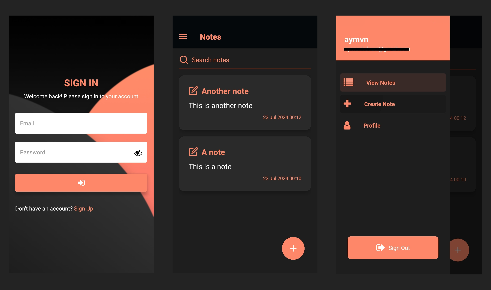

# Notes App

A simple note-taking application built with React Native and Expo.



## Table of Contents

-   [Overview](#overview)
-   [Features](#features)
-   [Installation](#installation)
-   [Usage](#usage)
-   [Folder Structure](#folder-structure)
-   [Environment Variables](#environment-variables)
-   [Contributing](#contributing)
-   [License](#license)

## Overview

This project is a comprehensive note-taking application built with React Native and Expo. It includes features like user authentication, profile management, and CRUD operations for notes. The application uses Tailwind CSS for styling and integrates with a backend API using Axios.

## Features

-   **User Authentication:** Sign up and sign in functionality to securely manage user accounts.
-   **Profile Management:** Users can view profile information.
-   **Note Management:** Create, edit, and delete notes with a user-friendly interface.
-   **Custom Drawer Content:** Customized navigation drawer for enhanced user experience.
-   **Responsive Design:** Tailwind CSS ensures a responsive and visually appealing design.
-   **API Integration:** Axios is used for seamless communication with the backend API.

## Installation

1. **Clone the repository:**

    ```sh
    git clone https://github.com/itzAymvn/notes-app.git
    cd notes-app
    ```

2. **Install dependencies:**

    ```sh
    npm install
    ```

3. **Start the development server:**
    ```sh
    npx expo start
    ```

## Usage

-   **Sign Up:** Create a new account by providing your name, email, and password.
-   **Sign In:** Log in to your account using your email and password.
-   **Create Note:** Add a new note by providing a title and description.
-   **Edit Note:** Update the title and description of an existing note.
-   **Delete Note:** Remove a note from the list of saved notes.
-   **View Profile:** Access your profile information and sign out from the application.

## Folder Structure

The project structure is organized as follows:

-   **assets:** Contains images and other static assets used in the application.
-   **components:** Includes reusable components like buttons, cards, and form fields.
-   **constants:** Contains files for storing constant values like colors and images.
-   **hooks:** Custom hooks for managing state and logic in functional components.
-   **lib:** Utility functions and modules like Axios for handling API requests.
-   **types:** TypeScript declaration files for defining custom types and interfaces.
-   **app:** Contains the main application files like the entry point and screens.

## Environment Variables

The project uses environment variables to store sensitive information like API keys and URLs. Simply copy the `.env.example` file to `.env` and update the values with your own credentials.

## Contributing

Contributions are always welcome! Please adhere to the following guidelines:

-   Fork the repository and create a new branch.
-   Make changes and test them thoroughly.
-   Submit a pull request with a detailed explanation of the changes made.

## License

Distributed under the MIT License. See `LICENSE` for more information.
